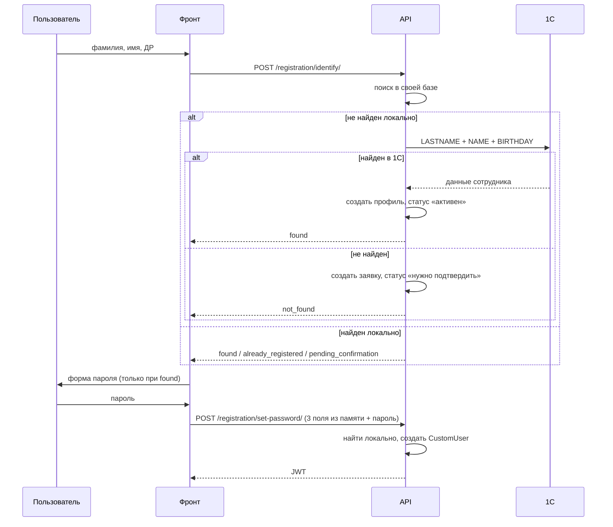

# Регистрация через веб-форму с прямым обращением к 1С

Реализация регистрации пользователя: две формы, прямой запрос в 1С, без прослойки RegBot.
Составлено по итогам обсуждения и разбора кода `DLS-copy/back`.

**Рамки задачи:**

- Telegram-бот **не трогаем** — работает как есть.
- `initData` мессенджера пока **не используем** — это отдельный блок работ другого разработчика.
  Разделы 9 и 10 описывают, что изменится, когда он появится.

---

## 1. Схема целиком

Два шага, между ними ничего не хранится.

**Шаг 1.** Человек вводит фамилию, имя и дату рождения. Бекенд сначала ищет его в своей базе,
потом — в 1С. Отвечает, что делать дальше.

**Шаг 2.** Фронт присылает **те же три поля из своей памяти** плюс пароль. Пользователь ничего
не вводит повторно. Бекенд находит запись локально и создаёт веб-аккаунт.

Связка шагов — по фамилии, имени и дате рождения. Ни токенов, ни серверных сессий.



---

## 2. Шаг 1 — опознание

### 2.1. Запрос

`POST /api/v1/registration/identify/`

```json
{
  "last_name": "Иванов",
  "first_name": "Иван",
  "birth_date": "15.01.1990"
}
```

Дата приходит как `дд.мм.гггг`, 1С ожидает `YYYY-MM-DD`. Конвертация на уровне сериализатора,
чтобы дальше по коду ходил только `date`:

```python
birth_date = serializers.DateField(input_formats=["%d.%m.%Y"])
```

Фамилию и имя прогонять через существующий `normalize_person_name`
из `app/bot/telegram/tg_services/registration_services.py` — он уже умеет приводить регистр
и обрезать пробелы.

### 2.2. Порядок проверок

Сначала **своя база**, потом 1С. Это не оптимизация, а закрытие двух реальных ситуаций:
человек начал регистрацию и закрыл вкладку, и человек, чью заявку админ подтвердил вчера.

```python
def resolve_local(last_name, first_name, birth_date) -> TelegramUser | None:
    return (
        TelegramUser.objects.filter(
            last_name__iexact=last_name,
            first_name__iexact=first_name,
            date_of_birth=birth_date.isoformat(),
        )
        .select_related("custom_user")
        .first()
    )
```

`date_of_birth` — это `CharField`, в котором 1С-овский формат `YYYY-MM-DD`. Для заявок,
создаваемых вручную, писать дату в том же виде, иначе поиск не сработает.

### 2.3. Ответы

| Ситуация | `state` | Что делает фронт |
|---|---|---|
| найден локально, `CustomUser` есть | `already_registered` | «вы уже зарегистрированы, войдите» |
| найден локально, статус 2 | `blocked` | обращение в поддержку |
| найден локально, статус 3 | `pending_confirmation` | «заявка на рассмотрении» |
| найден локально, `CustomUser` нет | `found` | **форма пароля** |
| не найден локально, найден в 1С | `found` | **форма пароля** |
| не найден нигде | `not_found` | «заявка отправлена администратору» |
| 1С не ответила | HTTP 503 | «попробуйте позже» + повтор |

Важно не путать `not_found` и 503: в первом случае создаётся заявка, во втором не делается
ничего. Сейчас различить их нельзя — см. 3.2.

В ответе **не отдаём данные сотрудника из 1С** — ни отчество, ни должность, ни телефон.
Соблазн показать «Иванов Иван Иванович, инженер — это вы?» понятен, но именно этот экран
подтверждает личность тому, кто просто угадал фамилию с датой рождения.

### 2.4. Ветка «найден»

1. Найти или создать `TelegramUser` **по `guid_1c`** из ответа 1С.
2. Заполнить профиль через `apply_employee_from_onec` — статус становится «активен» (1).
3. `CustomUser` пока не создаём.

### 2.5. Ветка «не найден»

Создать `TelegramUser` со статусом `STATE_NEED_CONFIRMATION` (3) и тем, что человек ввёл сам:
фамилия, имя, дата рождения, согласие на обработку ПД. Форму пароля не показываем — она ему
пока не нужна.

Когда администратор подтвердит заявку и поставит статус 1, человек проходит шаг 1 снова,
находится локально и получает форму пароля. Отдельного сценария писать не надо.

---

## 3. Обмен с 1С

### 3.1. Клиент уже написан

`app/integration/services/onec_client.py` — готовый клиент с BasicAuth, сейчас мёртвый код.
Учётные данные в модели `APISettings` (`api_url`, `api_username`, `api_password`).

Запрос:

```json
{
  "PHONE": "",
  "GUIDS": [],
  "LASTNAME": "Иванов",
  "NAME": "Иван",
  "BIRTHDAY": "1990-01-15"
}
```

Отчество не отправляем и у пользователя не спрашиваем.

Ответ — тот же формат, что раньше отдавал RegBot, поэтому маппинг переиспользуется:

| Поле | Куда ложится |
|---|---|
| `id` | `TelegramUser.guid_1c` |
| `fio` | режется на фамилию / имя / отчество |
| `birthday` | `date_of_birth` |
| `phone`, `email` | одноимённые поля |
| `div_id`, `div` | апсерт `Department` |
| `pdiv_id`, `pdiv` | апсерт родительского `Department` |
| `post_id`, `post` | апсерт `JobTitle` + связь с подразделением |

### 3.2. Что поправить в клиенте

`post_onec` возвращает `None` **на любую неудачу** — и на таймаут, и на HTTP 500, и на кривой
JSON. Отличить «1С недоступна» от «сотрудника нет» невозможно, а это разные экраны и разное
поведение. Привести к нормализованному виду, как в `post_regbot`:

```python
{
    "http_status": int | None,
    "found": bool,
    "data": dict | None,
    "error": str | None,
}
```

### 3.3. Несколько совпадений

Если под фамилию, имя и дату рождения подходит несколько сотрудников — берём первого, как
сейчас. Случай маловероятный, но такой ответ писать в лог с уровнем `warning`, чтобы он
не остался незамеченным.

---

## 4. Шаг 2 — пароль

`POST /api/v1/registration/set-password/`

```json
{
  "last_name": "Иванов",
  "first_name": "Иван",
  "birth_date": "15.01.1990",
  "password": "..."
}
```

Три поля фронт берёт из своей памяти после первого шага — человек их не перевводит.

Логика:

1. Найти запись локально тем же `resolve_local`. Нет — 404.
2. **Если `CustomUser` уже существует — отказ.** Одна строка, но она закрывает самое опасное:
   иначе можно перезаписать пароль тому, кто уже зарегистрирован.
3. Статус 2 или 3 — отказ с понятным текстом.
4. Валидировать пароль штатным `django.contrib.auth.password_validation.validate_password`,
   а не проверкой длины, как сейчас в боте.
5. Создать `CustomUser` с `is_active=True`, вернуть пару JWT.

### 4.1. Логин и email

`email` заполняем из 1С, когда он есть — по нему человек входит с компьютера, и работает
существующий сброс пароля через письмо. У части сотрудников почты нет, это нормально:
у них останется вход по `username`.

`username` — технический уникальный идентификатор, человек его не видит: GUID сотрудника
из 1С, а для заявок без 1С — `user_{telegram_user.pk}`.

Текущую генерацию использовать нельзя:

```45:45:DLS-copy/back/app/bot/services/custom_user_service.py
                "username": telegram_user.user_name or f"user_{telegram_user.telegram_id}",
```

У новых пользователей `telegram_id` пустой, поэтому все получат `username = "user_None"`,
и второй же человек упадёт на уникальности.

---

## 5. Изменения в схеме

```python
telegram_id = models.BigIntegerField(
    verbose_name="Telegram ID", unique=True, null=True, blank=True
)
guid_1c = models.CharField(
    max_length=50, verbose_name="Код 1С", unique=True, null=True, blank=True
)
personal_data_consent_at = models.DateTimeField(
    verbose_name="Дата согласия на обработку ПД", null=True, blank=True
)
```

**`telegram_id` обязан стать nullable.** Регистрация идёт вне Telegram, значит у всех новых
пользователей это поле пустое. В PostgreSQL уникальность с несколькими `NULL` работает.

Побочная польза: исчезает костыль с фиктивным пользователем, который сейчас создаётся для
админов в двух местах (`auth_views.py:118-133` и `auth_serializers.py:301-315`)
с магическим `150000000000 + user.id`.

**`guid_1c` становится ключом сопоставления с 1С**, поэтому ему нужен уникальный индекс —
иначе при повторных регистрациях наплодятся дубли одного сотрудника.

**Отметка времени согласия** нужна, чтобы согласие можно было предъявить. Сейчас это голый
булев флаг без даты.

### 5.1. `apply_employee_from_onec` — обязательная правка

Функция сама ищет пользователя по `telegram_id`:

```162:167:DLS-copy/back/app/integration/services/onec_mapping.py
    user, _ = TelegramUser.objects.get_or_create(
        telegram_id=telegram_id,
        defaults={
            "user_name": username,
        },
    )
```

С `telegram_id=None` это не просто бесполезно — при втором таком пользователе `get_or_create`
упадёт с `MultipleObjectsReturned`, потому что NULL-ов в базе будет много.

Добавить необязательный параметр `user`: если передан — применять данные к нему, если нет —
работать по-старому. Вызов из Telegram-бота остаётся нетронутым, а новый код сам ищет запись
по `guid_1c` и передаёт готовый объект.

---

## 6. Что переиспользуем и что пишем

Без изменений: `LoginSerializer`, выдача JWT, сброс пароля, весь Telegram-бот,
`apply_employee_from_onec` по составу полей.

Пишем:

| Что | Где |
|---|---|
| Сервис регистрации | `app/bot/services/registration_service.py` |
| Два эндпоинта | `app/bot/views/registration_views.py` |
| Сериализаторы | `app/bot/serializers/registration_serializers.py` |
| Нормализация `post_onec` | `app/integration/services/onec_client.py` |
| Параметр `user` в маппинге | `app/integration/services/onec_mapping.py` |
| Генерация `username` | `app/bot/services/custom_user_service.py` |
| Миграция схемы | `app/bot/migrations/` |
| Две формы | фронт |

Вся логика — **в одном сервисе**, вьюхи тонкие: разобрали запрос, вызвали сервис, отдали ответ.
Это нужно не для красоты: подключение `initData` и последующее слияние моделей должны править
одно место, а не десять.

---

## 7. Безопасность

Зафиксирую честно: связка шагов по фамилии, имени и дате рождения **подделываема**. Любой,
кто знает эти три поля о сотруднике, может зарегистрироваться под ним и получить его данные
из 1С. Решение принято сознательно — альтернативы (подписанный токен, `initData`) либо
дороже, либо зависят от другого разработчика, и ни одна из них полностью проблему не решает.

Что делаем в компенсацию:

- **Жёсткий лимит на шаг 1** через `ScopedRateThrottle` — это ровно эндпоинт перебора.
  Отдельный scope, несколько попыток в час на IP.
- **Временная блокировка IP** после серии неудачных опознаний.
- **Лог каждой попытки**: IP, результат, фамилия. Полный набор персональных данных в лог
  не пишем.
- **Отказ на шаге 2, если `CustomUser` уже есть** — не даём перезаписать пароль
  зарегистрированному человеку.
- **Ничего лишнего в ответе шага 1** — только `state`.
- Пароль не логировать ни на одном шаге.

Отдельно про фронт: `stores/auth.ts` сейчас сохраняет пароль открытым текстом в localStorage.
Новые формы нельзя писать по образцу существующей авторизации.

**Гонка при двойной отправке.** Два параллельных запроса не должны создать двух пользователей:
`get_or_create` по `guid_1c` внутри `transaction.atomic` плюс уникальный индекс на поле.

---

## 8. Технический долг, который нельзя тащить дальше

**`CustomUser.save()` с перехешированием пароля** (`telegram_user.py:130-135`) — костыль под
админку, на нём висит TODO. Он ломает `set_unusable_password()` и делает поведение модели
неочевидным. Убрать, админку настроить через `UserChangeForm`.

**`assign_obligatory_courses()` внутри `TelegramUser.save()`** — пока модели две, терпимо.
При слиянии с `CustomUser` начнёт срабатывать на каждом входе, потому что Django после логина
вызывает `user.save(update_fields=["last_login"])`, а переопределённый `save()` выполняется
независимо от `update_fields`. Вынести в явный вызов — при регистрации и при смене
подразделения или должности.

**Новые эндпоинты сразу «мои».** Ни один новый адрес не должен принимать идентификатор
пользователя в пути. Все существующие принимают `telegram_user_id` из URL и не проверяют
владение — отсюда возможность читать чужой прогресс и чужие результаты. Новый код эту болезнь
наследовать не должен.

---

## 9. Когда появится `initData`

`initData` — подписанная строка, которую мессенджер выдаёт мини-приложению при запуске.
Содержит идентификатор пользователя и подпись на токене бота, поэтому бекенд может доказать,
что данные настоящие. У MAX алгоритм проверки совпадает с телеграмным
(`dev.max.ru/docs/webapps/validation`), с двумя отличиями: данные лежат во фрагменте URL
в параметре `WebAppData`, и значения нужно URL-декодировать перед склейкой.

Что изменится:

- появится поле `max_id` (nullable, unique) — постоянная связь с пользователем мессенджера;
- шаг 2 перестанет принимать три поля: кому принадлежит пароль, будет видно из подписи;
- добавится вход в СДО из мессенджера без пароля;
- «кто сейчас регистрируется» стоит определять **в одной функции** — сегодня она читает
  три поля из запроса, тогда будет читать подпись. Это единственное место, которое поменяется.

Чего `initData` **не** даёт: он докажет, что за экраном аккаунт Васи, но не помешает Васе
ввести данные Жоры. Полностью подмену закрывает только сверка телефона, а телефоны в 1С
заполнены не у всех и не всегда актуальны — поэтому на неё не рассчитываем.

---

## 10. Дорожная карта

**Сейчас.**

1. Нормализовать ответ `post_onec`, подключить `APISettings`.
2. Миграция: `telegram_id` nullable, `guid_1c` unique, отметка времени согласия.
3. Параметр `user` в `apply_employee_from_onec`, генерация `username`.
4. `RegistrationService` — вся логика без HTTP. Тесты на ветки: найден в 1С, найден локально
   без пароля, уже зарегистрирован, статус 3, не найден, 1С недоступна, повторная отправка
   шага 2.
5. Два эндпоинта, троттлинг, схема в drf-spectacular.
6. Две формы на фронте.

Первые пять пунктов проверяются curl-ом, фронт можно начинать после того, как контракт устоялся.

**Потом — `initData`** (см. 9), когда будет готов блок коллеги.

**Потом — слияние `TelegramUser` в `CustomUser`.** Модель появилась в первой версии проекта,
когда веба не планировалось, и сегодня разделение уже вредит: из-за него существует фиктивный
пользователь для админов, из-за него все эндпоинты принимают идентификатор в URL и уязвимы
к подстановке чужого, из-за него фронт таскает `telegram_user_id` в каждом вызове.

Работа механическая: порядка десяти связей (`UserRead`, `UserTest`, `UserRating`,
`TelegramGroup`, `SubscriptionUser`, сертификаты, обязательные курсы, статусы новостей,
M2M на курсах) плюс перелив данных. Внешние идентификаторы при этом лучше вынести в отдельную
таблицу с уникальностью по паре «провайдер + внешний id», а не держать колонкой на каждый
мессенджер.

---

## 11. Риски и открытые вопросы

**Отключение RegBot убьёт регистрацию в Telegram.** Старый FSM-сценарий ходит в 1С только
через него. Пока сервис жив — всё работает и бота трогать не нужно. В день отключения
регистрация в Telegram перестанет работать молча.

**Контактные данные для ненайденных.** Сейчас в форме только фамилия, имя и дата рождения —
администратор, разбирая заявку, не увидит ни телефона, ни почты, и ему нечем найти человека
в кадрах. Стоит решить, добавлять ли эти два поля в ветку «не найден».

**Компания по умолчанию.** Берётся первая активная (`_get_default_company`). Если юрлиц
реально несколько — это ошибка, и её удобно закрыть вместе с этой задачей.

**Однофамильцы с одной датой рождения.** Принято брать первого из ответа 1С. Тот же случай
ломает и локальный поиск на шаге 2: два человека с совпадающими фамилией, именем и датой
рождения будут неразличимы. Вероятность низкая, но если она станет реальной — понадобится
уточняющее поле.
